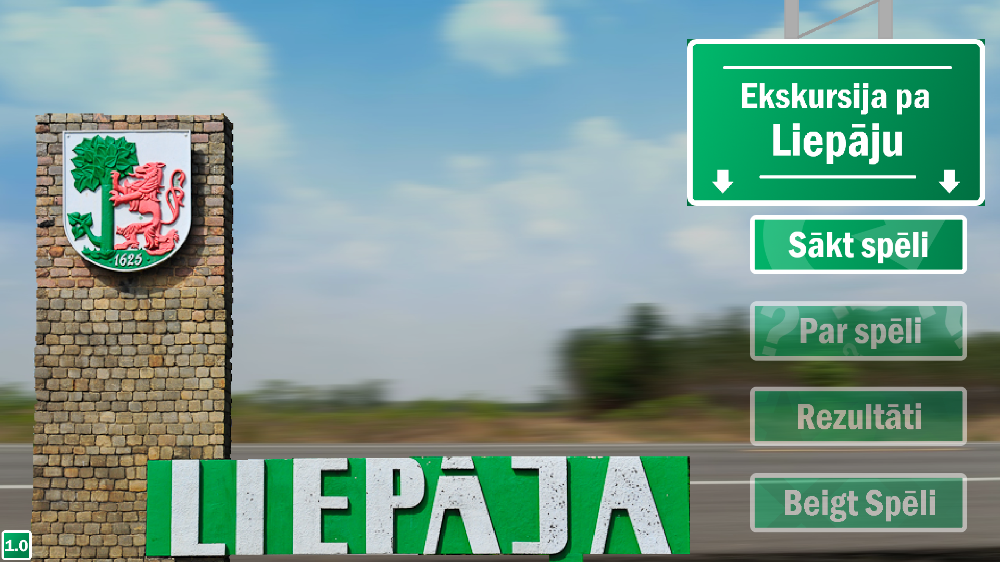
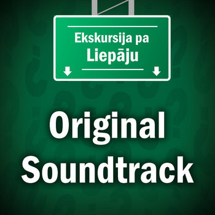
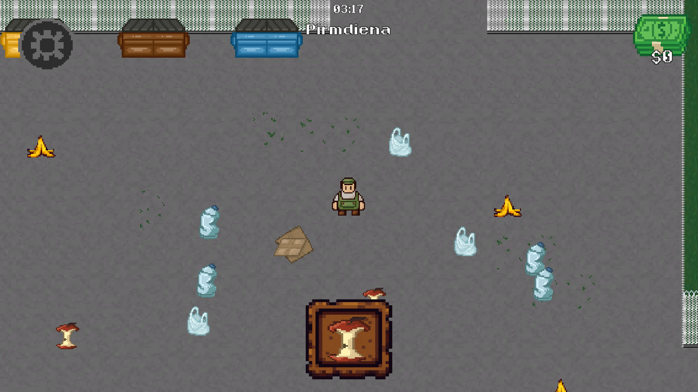
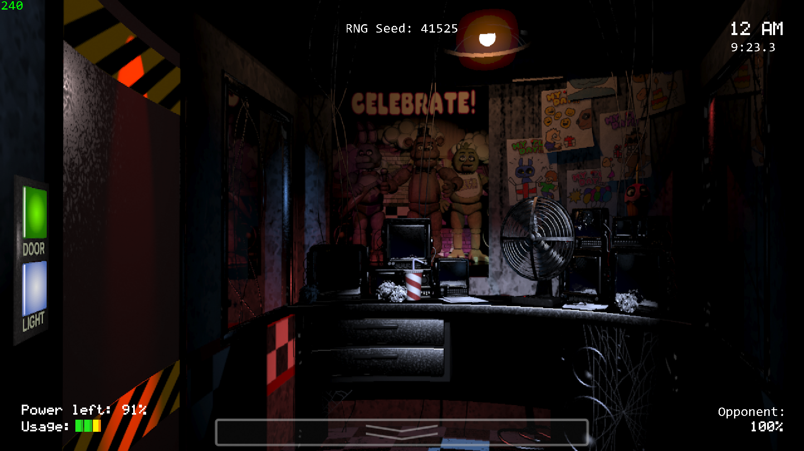
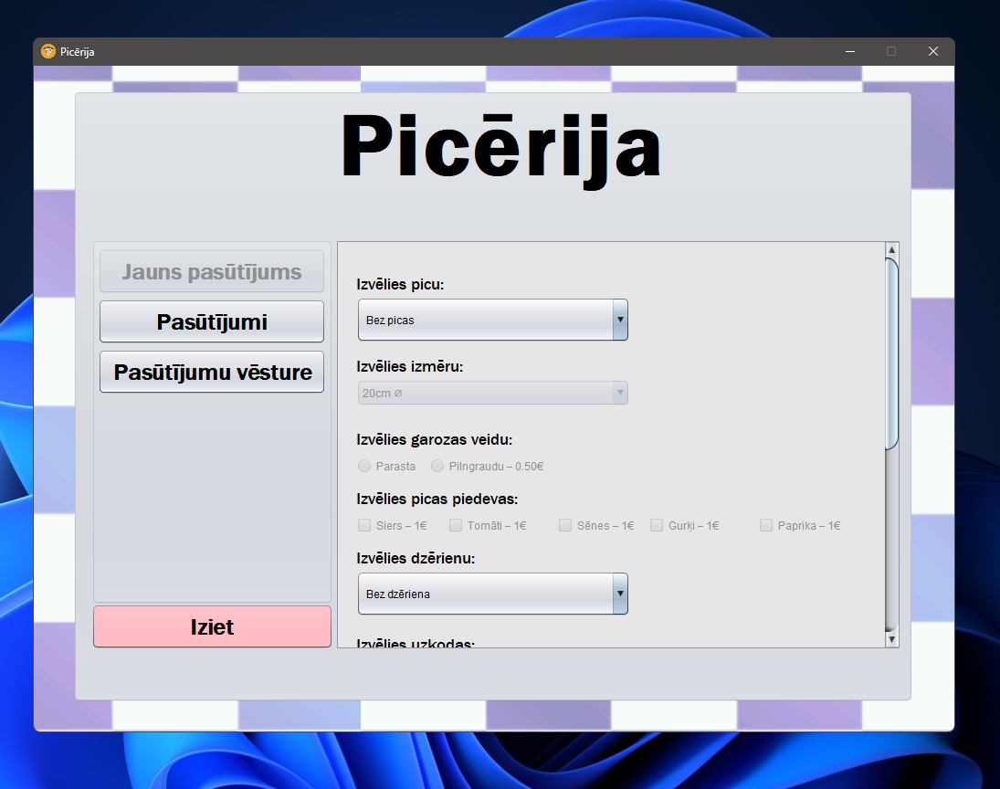

## Hello!👋

I'm a 3rd-year programming student in Latvia, mainly interested in **software development and game development**.
I mostly work with **Java/OOP and GameMaker/GML**, and enjoy building projects outside of school.
I also compose digital music.

### Skills 💪

#### I'm comfortable with
- Java / OOP
- GameMaker / GML
- HTML / CSS / JavaScript
- Python

#### I am familiar with
- C++ & C#
- Lua

### Tools 🔧
- Git / GitHub / GitHub Desktop
- Visual Studio / Visual Studio Code
- draw.io
- Asana
- Figma

### Showcase 🌟
These are (currently) my notable projects or collaborations:
| Project | Description | Preview |
| --- | --- | --- |
| [Ekskursija pa Liepāju](https://github.com/eclipsevoidd/ProjektsLiepaja) | A GameMaker game developed as part of a team for the 2026 "Liepājas Datorzinātņu olimpiāde", which placed 1st overall. The game features an explorable Liepāja map and over 10 minigames. | 
| [Ekskursija pa Liepāju - OST](https://eclipsevoid.bandcamp.com/album/ekskursija-pa-liep-ju-original-soundtrack) | Original soundtrack for Ekskursija pa Liepāju, composed and produced by me. | 
| [Šķirošanas Banda](https://github.com/sams7891/trash_gang)| A GameMaker game created for the 2025 Liepājas RAS game jam. Features an upgrade system, progression, expanding locations and multiple possible endings.| 
| [fnaf1_gml](https://github.com/eclipsevoidd/fnaf1_gml)| A work-in-progress FNaF 1 port to GameMaker. The project focuses on understanding and improving an existing game implementation, including optimization and quality-of-life features. | 
| [Java OOP Picērija](https://github.com/eclipsevoidd/JavaOOP_Picerija) | A visual Java mock pizza order placement program, built with the Java Swing library components. This project also utilizes Object-Oriented Programming principles to set up orders. | 

### Socials 🌐
- 🎵 [Bandcamp](https://eclipsevoid.bandcamp.com/album/ekskursija-pa-liep-ju-original-soundtrack)

*Thanks for visiting :)*
